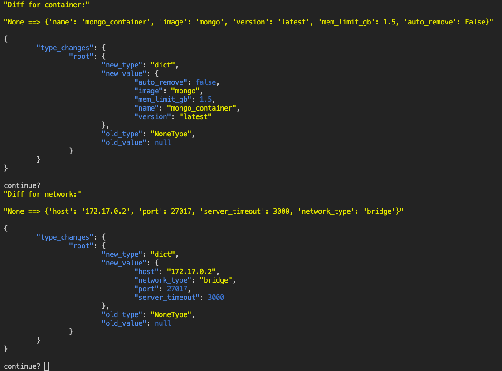

<html>

<head>
    <link rel="preconnect" href="https://fonts.googleapis.com">
    <link rel="preconnect" href="https://fonts.gstatic.com"     crossorigin>
    <link href="https://fonts.googleapis.com/css2?family=Source+Code+Pro:wght@400&family=Source+Sans+Pro:wght@300&    display=swap" rel="stylesheet">
    <link rel="stylesheet" href="https://github.com/cloudymax/io_tools/blob/master/cool_css.css">
</head>

<svg fill="none" background-size=contain viewBox=100% width=100% height=100% xmlns="http://www.w3.org/2000/svg">

<foreignObject class="flex-container" width="100%" height="100%" background-size=contain;>

<div xmlns="http://www.w3.org/1999/xhtml">

# I/O Tools

___
Data/file manipulation tools to prevent me from having to write out json serilization a million times. Tries to make you code your variables in a a way that can lift-and-shift easily.

## Usage

___

```python
import io_tools as io # custom lib

debug = True
go_steppy = False
working_directory = os.getcwd()

#load the settings file
settings_file = sys.argv[1]
settings = io.read_file(settings_file)
vars = Vars(settings, debug, go_steppy)

#set some env vars
vars.change_value('working_dir', working_directory, debug)

```

## Functions

___

### <emph>>get_timestamp</emph>

 Returns a timestamp in `DD:MMM:YYYY (HH:MM:SS.f)` format

### <emph>>read_file</emph>

 Reads json file from path: returns json object

### <emph>>azure_auto_instal</emph>

 Attempts to force azure cli to auto-install cost management module

### <emph>>print_pretty</emph>

 Prettified json console output: returns `<string>`

### <emph>>colorize_json</emph>

 Prints colorful json

### <emph>>vailidate_json_file</emph>

 Takes a `file_path`, returns `query{dict(<string>,<string>)}`

### <emph>>validate_json_object</emph>

 Takes a `file_path`, returns `query{dict(<string>,<string>)}`

### <emph>>write_file</emph>

 Attempt to save <payload> to disk at <path> as json file

### <emph>>update_file</emph>

 Update an existing file on disk

### <emph>>make_dir</emph>

 Makes/deletes directory


## Class Methods

___
### <emph>>Datastore()</emph>

 Datastore is a `<key>:<value>` dict that accepts any  types and is used for portability. It achieves this  by storing all variables in a generic dictionary  with the `change()` method overriden to be an event  system.

### <emph>Variables()</emph>

 Object that holds a list of `Datastore()`s,
 When eneabled, the built-in `go_steppy()` function  will pause script execution on any memory state  change to provide a json formatted diff. for example:

 

### <emph>change_value()</emph>

 Triggered when any variable within the `Datastore()`  is updated, or created.

### <emph>get_current_value()</emph>

 Returns the current value of a variable within the `Datastore()`, and triggers an event.

### <emph>diff_values()</emph>

 When enabled, deepdiffs the current and proposed change to the `Datastore()` object

</ul>
</div>
</foreignObject>
</svg>
